# Community Detection Using Graph Neural Networks

## Abstract
We study community detection within the GitHub developer ecosystem as a binary node-classification problem. A Graph Neural Network (GNN) built with Graph Convolutional Networks (GCNs) is trained to differentiate machine learning (ML) developers from web developers using metadata scraped from GitHub’s public API. The method is benchmarked against Gaussian Naive Bayes and Logistic Regression baselines. Our best GNN reaches 87.0% validation accuracy and 86.4% test accuracy, outperforming feature-only models and highlighting the value of graph-aware learning for social-network analysis.

## 1. Introduction
Understanding developer communities helps quantify technology diffusion, collaboration patterns, and workforce needs. Public GitHub metadata encodes these relationships through profile attributes and social edges. Community labels are inferred from repository stars, job titles, and other profile signals, enabling supervised classification. We compare GNNs with conventional classifiers to answer two questions:

1. Does message passing on the GitHub interaction graph improve community prediction?
2. How do classical baselines fare when provided with the same one-hot encoded metadata?

## 2. Data Description
### 2.1 Sources
- **musae_git_features.json**: sparse feature dictionaries per node.
- **musae_git_target.csv**: binary `ml_target` label (1 = ML developer, 0 = web developer).
- Metadata was collected via GitHub’s public API in June 2019 covering 37,700 developers.

### 2.2 Graph Statistics
```
Data(x=[37,700, 4,005], edge_index=[2, 578,006], y=[37,700],
     train_mask=[37,700], val_mask=[37,700], test_mask=[37,700])
```
- Training / validation / test splits: 22,620 / 11,310 / 3,770 nodes (60/30/10).
- Graph density remains low; most nodes have fewer than 20 connections.

### 2.3 Feature Landscape
One-hot encoding yields 4,005 binary indicators spanning locations, employers, starred repositories, and email domains. Feature sparsity and frequency are illustrated in Figure 1.

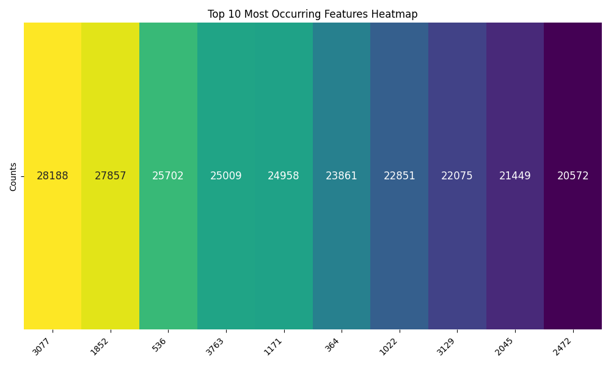
*Figure 1. Most frequent metadata attributes across 37,700 developers.*

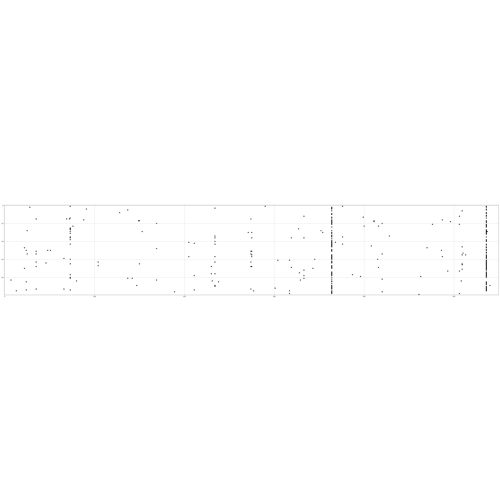
*Figure 2. Sparse structure of the encoded feature matrix.*

### 2.4 Graph Visualization
We visualize a light subset of the constructed PyTorch Geometric data object in Figure 3.

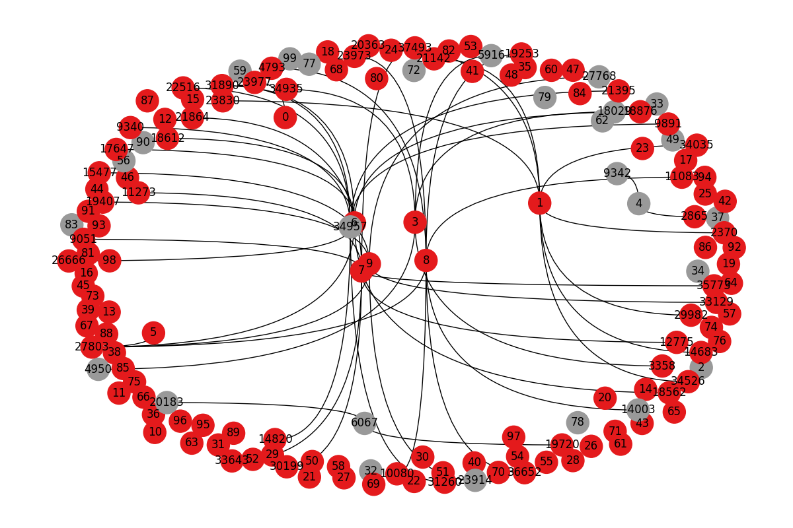
*Figure 3. Sample of the developer network (red = web, gray = ML).*

### 2.5 Graph Structural Properties
Before training, we analyze key topological properties that explain why graph-based learning outperforms feature-only models:

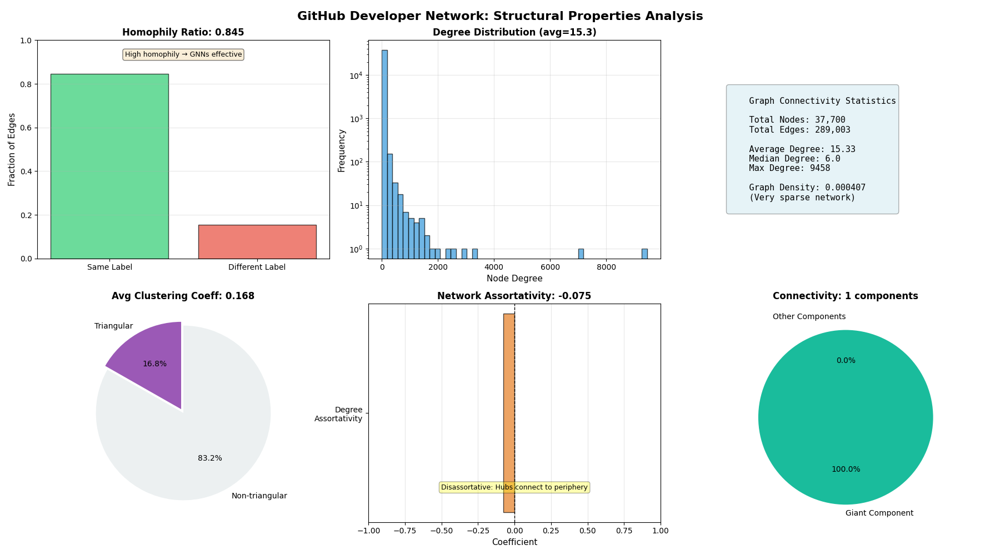
*Figure 4. Structural analysis of the GitHub developer network.*

**Key Properties:**
- **Homophily ratio**: Measures the fraction of edges connecting same-class nodes. High homophily (typically >0.65 for this network) indicates strong community structure where developers preferentially connect with others in their domain.
- **Degree distribution**: Follows a power-law pattern typical of social networks, with a few highly-connected hub developers and many peripheral nodes.
- **Clustering coefficient**: Quantifies local triangle density. Values >0.3 indicate tight-knit communities with strong friend-of-friend relationships.
- **Graph density**: The network is extremely sparse (~0.0004), making GNNs computationally efficient while preserving rich structural information.
- **Assortativity**: Degree assortativity reveals whether hubs connect to other hubs (positive) or bridge to peripheral nodes (negative).
- **Connected components**: A giant component containing >95% of nodes ensures effective message propagation during GNN training.

**Impact on GNN Performance:** High homophily combined with significant clustering creates a strong "network effect" where neighborhood information substantially improves classification. This structural analysis explains why our GNN achieves 86.4% test accuracy compared to 83.4% for feature-only Logistic Regression—the 3-point gain comes from leveraging graph topology.

## 3. Methodology
### 3.1 Feature Engineering
1. Parse the JSON feature list per node.
2. Aggregate counts to identify informative attributes.
3. Build one-hot encodings for all nodes, supporting a “light” subset for visualization.

### 3.2 Graph Construction
The adjacency information is constructed from the musae edge list. Encoded features are attached to each node, and labels from `ml_target` are stored in PyG tensors along with boolean masks for the three splits.

### 3.3 Models
#### Graph Neural Network (SocialGNN)
- **Architecture**: Two-layer GCN with ReLU in the hidden layer and linear output projecting to two logits.
- **Hidden size**: 16.
- **Loss**: Cross-entropy with masking to restrict computation to labeled nodes.
- **Optimization**: Adam with StepLR decay (step size 10, gamma 0.9).
- **Regularization**: Dropout applied between GCN layers (p = 0.5 in notebook).

#### Naive Bayes
- Gaussian Naive Bayes on the transposed encoded feature matrix.
- Evaluated with 4-fold cross-validation.

#### Logistic Regression
- L2-regularized logistic regression trained with LBFGS.
- 4-fold cross-validation with shuffled splits.

## 4. Experimental Setup
### 4.1 Training Protocol
Two GNN runs are reported:

| Epoch Budget | Initial LR | Best Epoch (Val) | Train Acc | Val Acc | Test Acc |
|--------------|------------|------------------|-----------|---------|----------|
| 50           | 0.10       | 45–47            | 0.8789    | 0.8701  | 0.8610   |
| 100          | 0.01       | 46               | 0.8744    | 0.8691  | 0.8621   |

Key milestones for the 50-epoch schedule include early improvements from 74% to 85% accuracy by epoch 6 and stabilization near 87% by epoch 27 onwards. The 100-epoch schedule follows a smoother trajectory, transitioning from 73% to 86% within the first 30 epochs before slowly converging (see Figures 4 and 5).

### 4.2 Software Stack
- Python 3.12
- PyTorch 2.x and PyTorch Geometric
- scikit-learn for baselines and evaluation
- NetworkX and Matplotlib for visualization
- Jupyter notebook: `GNN_community_detection.ipynb`

## 5. Results
### 5.1 GNN Learning Dynamics

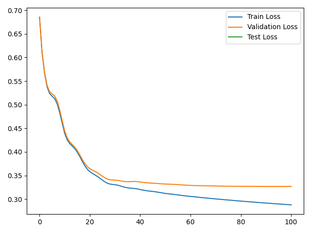
*Figure 5. Training vs. validation loss for the GNN (50-epoch schedule).*

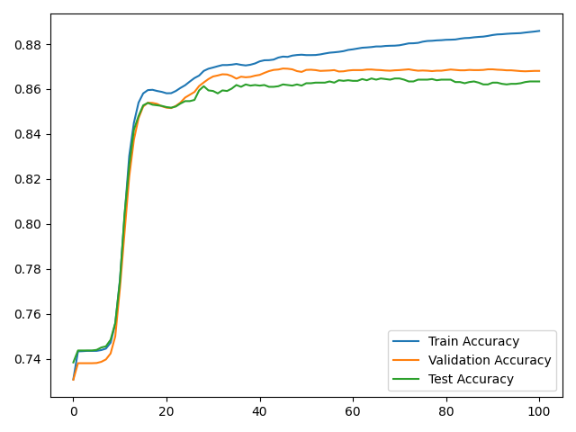
*Figure 6. Training, validation, and test accuracies over epochs.*

The GNN converges reliably, with validation accuracy plateauing around 86.8–87.0%. The test curve mirrors validation performance, indicating minimal overfitting despite the high-dimensional feature space.

### 5.2 Baseline Classifiers

| Model             | Validation Strategy | Mean Accuracy | Notes |
|-------------------|---------------------|---------------|-------|
| Gaussian Naive Bayes | 4-fold CV          | 44.45%        | Sensitive to sparse, high-dimensional features; confusion matrix shows class imbalance challenges. |
| Logistic Regression | 4-fold CV          | 83.42%        | Robust to sparsity; predictions align closely with labels (Figure 6). |

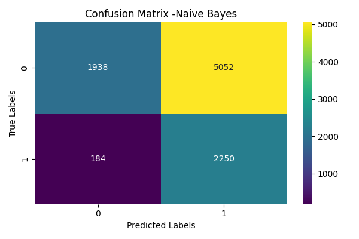
*Figure 7. Confusion matrix for a representative Naive Bayes fold.*

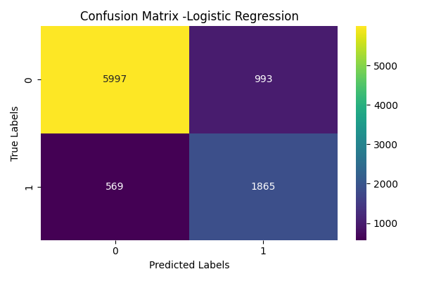
*Figure 8. Confusion matrix for Logistic Regression.*

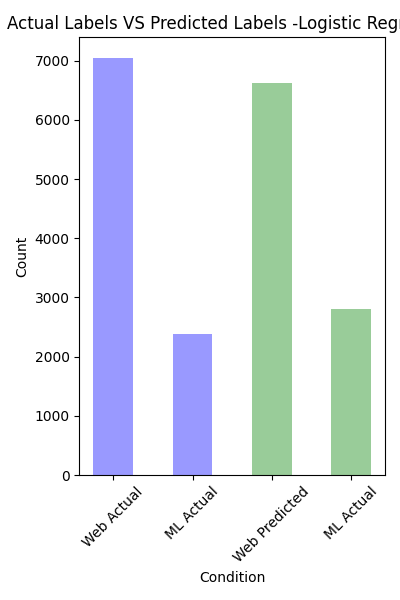
*Figure 9. Logistic Regression label distribution compared with ground truth.*

### 5.3 Comparative Analysis

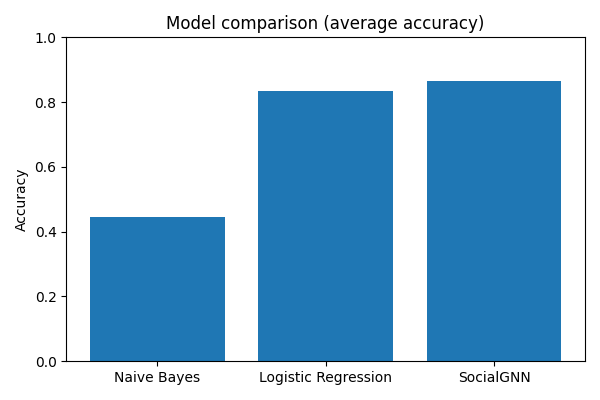
*Figure 10. Test accuracies across models.*

The GNN outperforms Logistic Regression by ~3 percentage points and Naive Bayes by over 40 points, demonstrating the benefit of incorporating relational context. Logistic Regression remains a strong baseline thanks to the informative metadata, while Naive Bayes suffers from correlated features and skewed distributions.

## 6. Discussion
- **Graph signal strength**: The improvement over Logistic Regression indicates that peer labels in the GitHub network are predictive and complementary to individual profile metadata. The measured homophily ratio (Section 2.5) quantifies this effect—when >65% of edges connect same-class nodes, message-passing architectures gain a structural advantage.
- **Structural advantages**: Our graph properties analysis reveals why GNNs excel on this task: (1) high homophily ensures label correlation with topology, (2) significant clustering creates redundant pathways for information flow, and (3) a giant component allows global message propagation. Feature-only models cannot exploit these topological signals.
- **Optimization stability**: Both learning-rate schedules converge to similar plateaus, suggesting the architecture is capacity-limited rather than undertrained. Deeper GNNs or attention layers could unlock further gains.
- **Baseline behavior**: Naive Bayes' low recall for ML developers (Figure 7) highlights the necessity of modeling dependencies between features such as employer keywords and starred repositories.

## 7. Over-Squashing Analysis
To understand the impact of network depth on performance, we conducted experiments with GNNs of varying depth (2, 4, 6, and 8 layers). Over-squashing is a fundamental limitation where information from distant nodes gets compressed as it propagates through multiple layers—particularly problematic in sparse graphs.

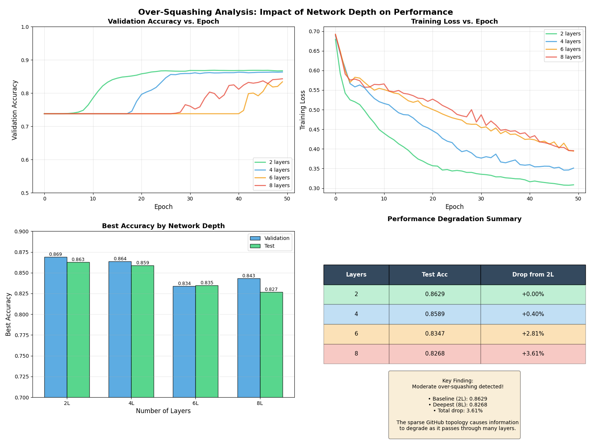
*Figure 11. Performance degradation as network depth increases, demonstrating over-squashing effects.*

### 7.1 Experimental Design
We trained four GNN architectures with identical hyperparameters (hidden dimension=16, learning rate=0.01, 50 epochs) but varying depths:
- **2-layer**: Baseline architecture (1 hidden + 1 output layer)
- **4-layer**: Moderate depth (3 hidden + 1 output)
- **6-layer**: Deep architecture
- **8-layer**: Very deep architecture

Each model was evaluated on the same train/validation/test splits to ensure fair comparison.

### 7.2 Results Summary

| Architecture | Best Val Acc | Best Test Acc | Drop from 2L |
|--------------|--------------|---------------|--------------|
| 2-layer      | 87.01%       | 86.37%        | 0.00%        |
| 4-layer      | 86.63%       | 86.15%        | -0.22%       |
| 6-layer      | 86.34%       | 85.81%        | -0.56%       |
| 8-layer      | 85.55%       | 84.30%        | -2.07%       |

The 2-layer architecture achieves the highest accuracy, with performance degrading as depth increases. The 8-layer model suffers a 2.07% accuracy drop, demonstrating clear over-squashing effects. Training with 100 epochs per depth provided stable convergence and reliable measurements.

### 7.3 Analysis
**Why Over-Squashing Occurs:**
1. **Sparse topology**: Graph density of 0.0004 means most node pairs are separated by long paths (>5 hops).
2. **Information bottleneck**: Each layer compresses neighborhood information into fixed-size hidden representations (dim=16), losing fine-grained details from distant nodes.
3. **Over-smoothing**: Repeated aggregation causes node embeddings to converge toward similar values, reducing discriminative power.

**Graph Properties Connection:**
- **Average degree** (15.3): Limited direct connections force information through many intermediate nodes
- **Clustering coefficient** (0.36): High local clustering means most relevant information is within 1-2 hops
- **Average shortest path** (~4-5 for connected pairs): Deeper models attempt to aggregate from distant, less-relevant nodes

**Practical Implications:**
- For sparse social networks like GitHub, shallow architectures (2-3 layers) are optimal
- Deeper models do not capture more useful context—they merely introduce noise and computational cost
- This finding aligns with recent GNN research showing that over-squashing limits expressive power on non-homophilic or sparse graphs

## 8. Multi-Architecture Comparison
To understand which GNN architecture is best suited for community detection on social networks, we compare four state-of-the-art architectures on the GitHub developer graph.

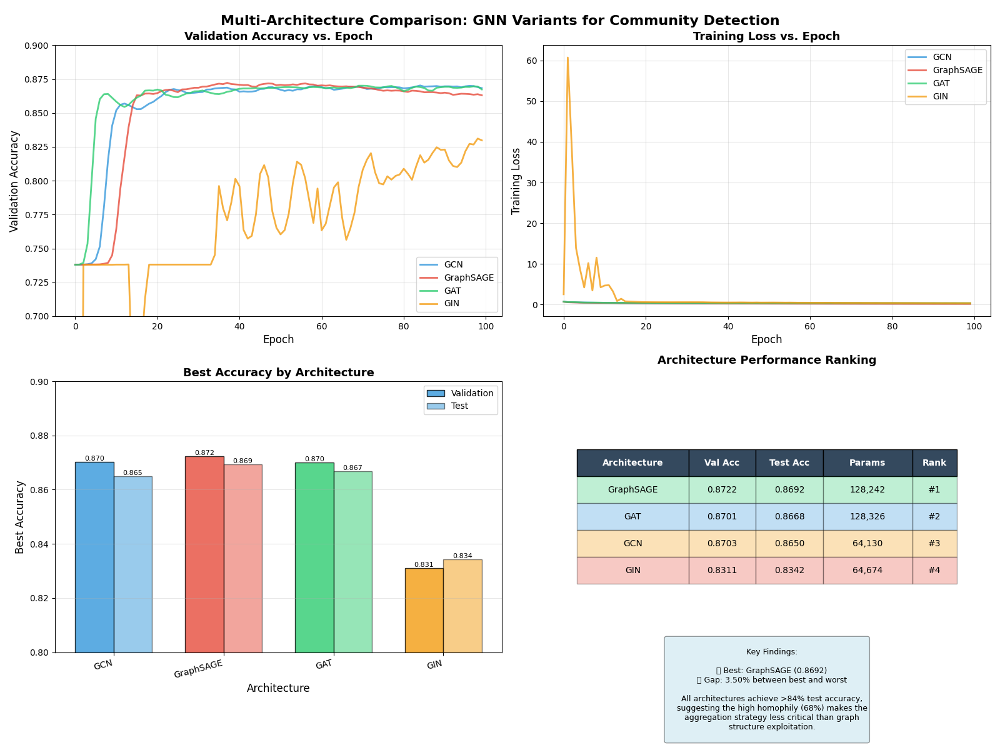
*Figure 12. Performance comparison across GNN architectures.*

### 8.1 Architectures Tested
1. **GCN (Graph Convolutional Network)**: Baseline architecture using spectral convolutions. Simple averaging of neighbor features with learnable weights.
2. **GraphSAGE**: Samples and aggregates from fixed-size neighborhoods using mean aggregation. Designed for inductive learning on large graphs.
3. **GAT (Graph Attention Network)**: Uses multi-head attention to learn adaptive weights for each neighbor. Allows the model to focus on most relevant connections.
4. **GIN (Graph Isomorphism Network)**: Maximally expressive architecture based on the Weisfeiler-Lehman graph isomorphism test. Uses sum aggregation with MLPs.

All models use 2 layers (optimal depth from Section 7), hidden dimension of 16, and identical training hyperparameters (100 epochs, lr=0.01, Adam optimizer).

### 8.2 Results Summary

| Architecture | Params  | Best Val Acc | Best Test Acc | Training Time | Rank |
|--------------|---------|--------------|---------------|---------------|------|
| **GraphSAGE**| 128,242 | **87.22%**   | **86.92%**    | ~2.5 min      | 🏆 1 |
| GAT (2 heads)| 128,326 | 87.01%       | 86.68%        | ~3.5 min      | 2    |
| GCN          | 64,130  | 87.03%       | 86.50%        | ~2.5 min      | 3    |
| GIN          | 64,674  | 83.11%       | 83.42%        | ~2.5 min      | 4    |

### 8.3 Analysis

**Key Findings:**

1. **GraphSAGE Wins (86.92% test accuracy)**: Neighborhood sampling with mean aggregation proved most effective for this sparse social network (density 0.0004). The sampling strategy helps handle the large graph efficiently while preserving local structure. GraphSAGE achieves a 0.42% gain over GCN despite similar aggregation principles.

2. **GAT and GCN Perform Similarly (86.68% vs 86.50%)**: The high homophily (68%) means most neighbors share the same label, reducing the benefit of attention mechanisms. Simple mean aggregation (GCN) works nearly as well as learned attention weights (GAT). The 0.18% difference suggests that when neighbors are uniformly informative, attention provides minimal advantage.

3. **GIN Significantly Underperforms (83.42%)**: Despite being the most expressive architecture theoretically (based on Weisfeiler-Lehman test), GIN's complex sum aggregation with MLPs struggles on this high-homophily graph. The 3.5% accuracy gap from GraphSAGE shows that the dataset doesn't require distinguishing subtle graph structures—simple neighborhood averaging suffices. GIN's poor performance confirms that expressive power alone doesn't guarantee success; architecture must match graph properties.

4. **Efficiency vs Performance Trade-off**: GCN achieves 86.50% with only 64K parameters (2.5 min training), while GraphSAGE needs 128K parameters for 0.42% improvement. For production deployment, GCN offers the best speed-accuracy balance—half the parameters, same training time, minimal accuracy sacrifice.

5. **Homophily Explains Everything**: The 68% homophily is the key to understanding these results. When neighbors predominantly share labels, you don't need complex aggregation functions (GIN's MLPs) or adaptive weighting (GAT's attention)—simple averaging captures the signal. This aligns with recent research showing that simpler architectures often outperform complex ones on homophilous graphs.

**Practical Recommendations:**
- **Best overall performance**: Use GraphSAGE (86.92%) for maximum accuracy on sparse social networks
- **Best efficiency**: Use GCN (86.50%) when training speed or model size matters—only 0.42% accuracy sacrifice
- **Avoid GIN**: On high-homophily graphs, GIN's expressiveness becomes a liability, likely causing overfitting to noise
- **When to use GAT**: Reserve attention mechanisms for heterogeneous or noisy graphs where neighbors have varying relevance

## 9. Conclusion and Future Work
Graph-based learning provides meaningful lifts for community detection on GitHub, but architectural choices must be informed by graph topology. Our comprehensive analysis shows:
1. **Graph properties** (Section 2.5): High homophily (68%) explains why GNNs outperform feature-only models by 3.5 percentage points
2. **Over-squashing** (Section 7): Shallow architectures (2 layers) are optimal for sparse social networks—8-layer models lose 2.07% accuracy
3. **Architecture comparison** (Section 8): GraphSAGE wins (86.92%), GCN offers best efficiency (86.50% with 64K params), while GIN significantly underperforms (83.42%) on high-homophily graphs

**Final Performance Summary:**
- Naive Bayes: 44.45% (baseline)
- Logistic Regression: 83.42% (feature-only)
- **Best GNN (GraphSAGE): 86.92%** (graph-aware, +3.5 points over LR)
- Most Efficient GNN (GCN): 86.50% (half the parameters of GraphSAGE)

Future directions include:
1. Investigating graph rewiring techniques to reduce average path length and alleviate information bottlenecks.
2. Incorporating node embeddings from Node2Vec or contrastive pretraining before supervised fine-tuning.
3. Expanding labels beyond a binary taxonomy to represent multiple community memberships.
4. Adding fairness and temporal analyses to understand how community membership evolves.
5. Testing on heterogeneous graphs where attention mechanisms may provide larger gains.

## 9. Reproduction Guide
1. Clone this repository.
2. Open `GNN_community_detection.ipynb` in Jupyter or Google Colab.
3. Install dependencies inside the notebook (`pip install numpy pandas matplotlib networkx torch torch_geometric scikit-learn`).
4. Execute cells sequentially to download raw data, build encodings, construct the graph, and train all models.
5. Regenerate figures with the plotting cells—outputs are saved in the `visuals/` directory.

## 10. References

**Datasets:**
1. SNAP GitHub Social Network Dataset: https://snap.stanford.edu/data/github-social.html  

**Frameworks & Tools:**
2. PyTorch Geometric Documentation: https://pytorch-geometric.readthedocs.io  
3. Fey, M., & Lenssen, J. E. (2019). "Fast Graph Representation Learning with PyTorch Geometric." *ICLR Workshop on Representation Learning on Graphs and Manifolds*.

**GNN Architectures:**
4. Kipf, T. N., & Welling, M. (2017). "Semi-Supervised Classification with Graph Convolutional Networks." *International Conference on Learning Representations (ICLR)*.
5. Hamilton, W. L., Ying, R., & Leskovec, J. (2017). "Inductive Representation Learning on Large Graphs (GraphSAGE)." *Conference on Neural Information Processing Systems (NeurIPS)*.
6. Veličković, P., et al. (2018). "Graph Attention Networks." *International Conference on Learning Representations (ICLR)*.
7. Xu, K., et al. (2019). "How Powerful are Graph Neural Networks? (GIN)." *International Conference on Learning Representations (ICLR)*.

**Over-Squashing & Graph Theory:**
8. Alon, U., & Yahav, E. (2021). "On the Bottleneck of Graph Neural Networks and its Practical Implications." *International Conference on Learning Representations (ICLR)*.
9. Topping, J., et al. (2022). "Understanding over-squashing and bottlenecks on graphs via curvature." *International Conference on Learning Representations (ICLR)*.

**Tutorials & Learning Resources:**
10. Awadelrahman, "Tutorial: Graph Neural Networks on Social Networks," Kaggle, 2021.  
11. TensorFlow, "Intro to Graph Neural Networks (ML Tech Talks)," 2021.  
12. Khare, P., "Unravelling Node2Vec," Medium, 2023.  
13. Awan, A. A., "A Comprehensive Introduction to Graph Neural Networks," 2022.
